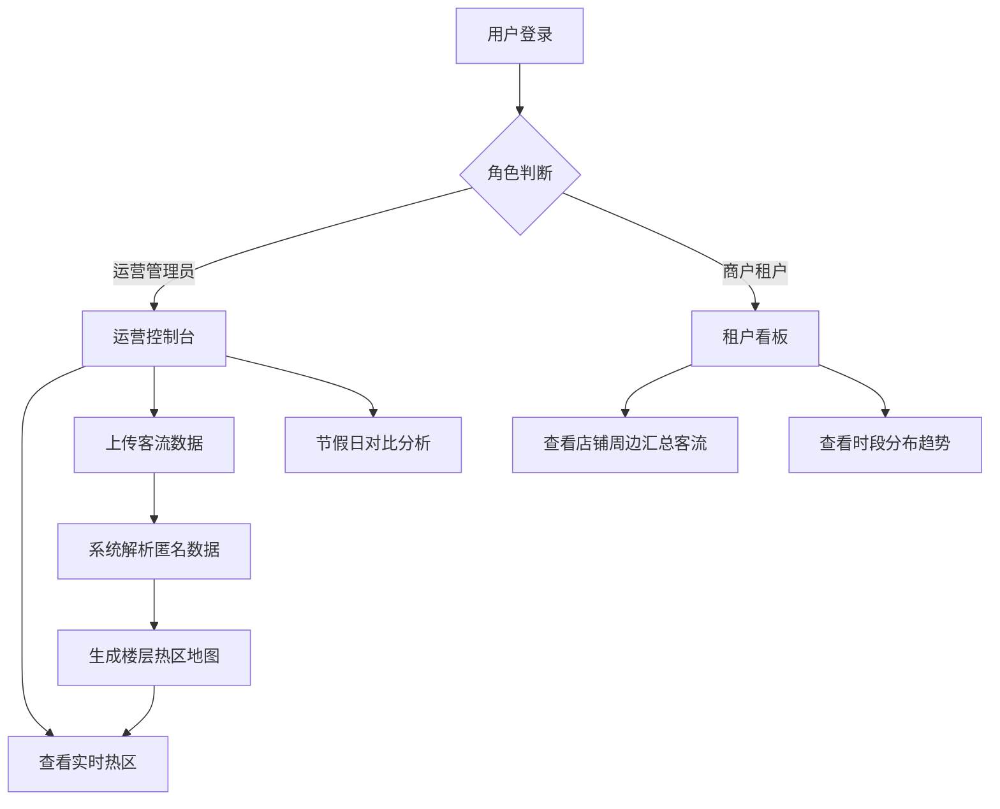

## 1. 产品概述

商场客流热区匿名分析平台是一款面向购物中心运营管理和商户租户的数据分析工具，通过匿名化的摄像头和 Wi-Fi 客流数据，提供楼层、入口、时段多维度的拥挤区域可视化分析，同时保障个人隐私安全。

- 核心价值：帮助运营方优化资源配置、提升商户经营效率，同时严格遵守隐私保护规范
- 目标用户：商场运营管理人员、品牌商户/租户

## 2. 核心功能

### 2.1 用户角色

| 角色 | 注册方式 | 核心权限 |
|------|----------|----------|
| 运营管理员 | 系统分配账号 | 上传客流数据、查看全商场热区、节假日对比分析、数据导出 |
| 商户租户 | 运营方开通 | 查看自身店铺附近区域的汇总客流数据、时段趋势 |

### 2.2 功能模块

1. **登录页**：角色选择、账号密码登录
2. **运营控制台**：实时客流总览、楼层热区地图、入口统计、时段趋势
3. **数据上传页**：摄像头/Wi-Fi 匿名客流数据批量上传
4. **热区对比页**：节假日/活动前后热区变化对比分析
5. **租户看板**：租户专属区域客流汇总、时段分布、邻近区域对比

### 2.3 页面详情

| 页面名称 | 模块名称 | 功能描述 |
|----------|----------|----------|
| 登录页 | 角色切换 | 运营/租户角色切换登录 |
| 登录页 | 登录表单 | 账号密码验证、记住登录 |
| 运营控制台 | 数据总览卡片 | 今日客流、峰值时段、最拥挤楼层等关键指标 |
| 运营控制台 | 楼层选择器 | 切换不同楼层查看热区 |
| 运营控制台 | 热区地图 | 基于楼层平面图的彩色热力图展示拥挤程度 |
| 运营控制台 | 入口客流排行 | 各入口实时/历史人流量柱状图 |
| 运营控制台 | 时段趋势图 | 24小时客流折线图，支持多日对比 |
| 数据上传页 | 文件上传 | 支持 CSV/Excel 格式的匿名客流数据上传 |
| 数据上传页 | 上传记录 | 历史上传记录列表与状态 |
| 热区对比页 | 时间选择器 | 选择两个时间段进行对比（如活动前后） |
| 热区对比页 | 对比热区地图 | 左右双栏展示两个时段的热区差异 |
| 热区对比页 | 变化分析 | 客流增减百分比、热点迁移分析 |
| 租户看板 | 店铺位置 | 高亮显示租户店铺及周边区域 |
| 租户看板 | 周边客流 | 店铺周围区域的匿名汇总客流 |
| 租户看板 | 时段分布 | 按小时展示客流高峰时段 |

## 3. 核心流程

运营管理员登录系统后，可上传摄像头或 Wi-Fi 统计的匿名客流数据，系统解析后生成楼层热区地图、入口统计和时段趋势。运营人员可选择节假日或活动的前后时间段进行热区变化对比分析。商户租户登录后只能查看自身店铺附近区域的汇总客流数据，无法获取个人轨迹或全商场数据。

## 4. 用户界面设计

### 4.1 设计风格

- 主色调：深靛蓝 (#1e3a5f) 搭配科技感青蓝 (#00d4ff) 作为强调色
- 辅助色：热力渐变色谱（青绿 → 黄色 → 橙红 → 深红）
- 按钮风格：圆角矩形，悬停时发光效果
- 字体：标题使用 Noto Serif SC 展现专业大气感，正文使用 Noto Sans SC 保证可读性
- 布局风格：深色科技仪表盘风格，卡片式模块布局，数据可视化为主
- 图标风格：lucide-react 线性图标，统一描边宽度

### 4.2 页面设计概述

| 页面名称 | 模块名称 | UI 元素 |
|----------|----------|----------|
| 登录页 | 背景区域 | 渐变深色背景 + 几何装饰线条 |
| 登录页 | 登录卡片 | 半透明毛玻璃效果卡片，居中布局 |
| 运营控制台 | 顶部导航 | 深色导航栏 + 品牌 Logo + 用户信息 |
| 运营控制台 | 指标卡片 | 带渐变色的圆角卡片，数值大号字体展示 |
| 运营控制台 | 热区地图 | SVG 楼层平面图 + 热力色叠加 + 悬浮提示 |
| 运营控制台 | 图表区域 | ECharts 柱状图/折线图，深色主题配色 |
| 数据上传页 | 上传区域 | 拖拽上传区 + 文件列表 |
| 热区对比页 | 双栏布局 | 左右各一个热区地图，中间对比指标 |
| 租户看板 | 店铺标识 | 地图上高亮标注店铺位置，脉冲动画 |

### 4.3 响应式设计

桌面端优先设计，最小适配宽度 1280px。主要数据看板区域固定最小尺寸，侧边导航在小屏幕可折叠为图标模式。

### 4.4 动效设计

- 页面加载：卡片依次淡入上浮，staggered 动画
- 热区地图：热点区域轻微脉动呼吸效果
- 数据更新：数字滚动动画，柱状图渐入动画
- 悬停反馈：卡片阴影加深、轻微上浮
