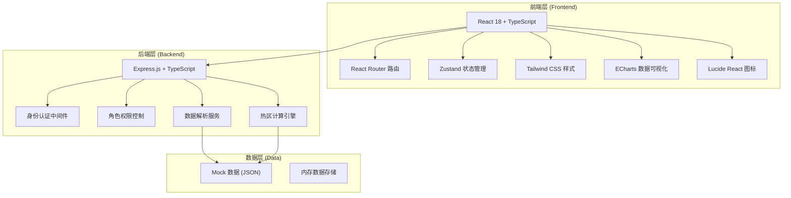
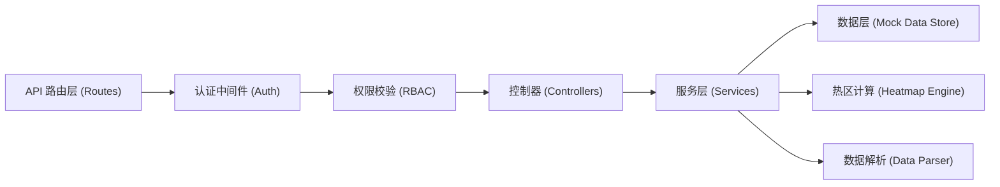
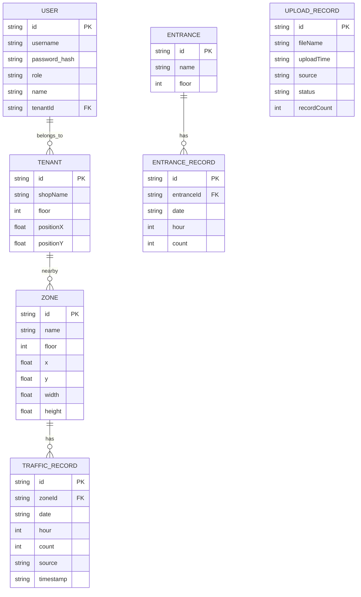

## 1. 架构设计



## 2. 技术说明

- **前端**：React@18 + TypeScript + Vite + TailwindCSS@3 + Zustand + React Router DOM + ECharts + Lucide React
- **初始化工具**：vite-init
- **后端**：Express@4 + TypeScript
- **数据存储**：Mock JSON 数据 + 内存存储，无需真实数据库

## 3. 路由定义

| 路由 | 用途 | 权限角色 |
|------|------|----------|
| /login | 登录页面 | 公开 |
| /dashboard | 运营控制台首页（客流总览+热区） | 运营管理员 |
| /upload | 客流数据上传页面 | 运营管理员 |
| /compare | 热区对比分析页面 | 运营管理员 |
| /tenant | 租户看板页面 | 商户租户 |

## 4. API 定义

```typescript
// 用户登录
interface LoginRequest {
  username: string;
  password: string;
  role: 'admin' | 'tenant';
}
interface LoginResponse {
  token: string;
  user: {
    id: string;
    name: string;
    role: 'admin' | 'tenant';
    tenantId?: string;
  };
}

// 客流总览数据
interface OverviewData {
  todayTotal: number;
  peakHour: string;
  peakCount: number;
  busiestFloor: string;
  busiestFloorCount: number;
  comparedYesterday: number; // 同比百分比
}

// 楼层热区数据
interface ZoneHeatData {
  zoneId: string;
  zoneName: string;
  floor: number;
  x: number;
  y: number;
  width: number;
  height: number;
  count: number;
  densityLevel: 1 | 2 | 3 | 4 | 5; // 1-5 拥挤等级
}

// 入口客流统计
interface EntranceData {
  entranceId: string;
  name: string;
  floor: number;
  hourlyData: { hour: number; count: number }[];
  total: number;
}

// 时段趋势
interface TrendData {
  date: string;
  hourlyData: { hour: number; count: number }[];
}

// 数据上传
interface UploadRecord {
  id: string;
  fileName: string;
  uploadTime: string;
  source: 'camera' | 'wifi';
  status: 'processing' | 'success' | 'failed';
  recordCount: number;
}

// 热区对比
interface CompareResult {
  periodA: {
    label: string;
    heatData: ZoneHeatData[];
    totalCount: number;
  };
  periodB: {
    label: string;
    heatData: ZoneHeatData[];
    totalCount: number;
  };
  changes: {
    zoneId: string;
    zoneName: string;
    diffCount: number;
    diffPercent: number;
  }[];
}

// 租户数据
interface TenantData {
  tenantId: string;
  shopName: string;
  floor: number;
  position: { x: number; y: number };
  nearbyZones: {
    zoneId: string;
    zoneName: string;
    count: number;
    densityLevel: number;
  }[];
  hourlyTrend: { hour: number; count: number }[];
}
```

### API 端点列表

| 方法 | 路径 | 说明 | 权限 |
|------|------|------|------|
| POST | /api/auth/login | 用户登录 | 公开 |
| GET | /api/overview | 获取客流总览数据 | 运营 |
| GET | /api/heatmap?floor=1 | 获取楼层热区数据 | 运营 |
| GET | /api/entrances | 获取入口客流统计 | 运营 |
| GET | /api/trend?days=7 | 获取时段趋势数据 | 运营 |
| POST | /api/upload | 上传客流数据文件 | 运营 |
| GET | /api/upload/records | 获取上传记录 | 运营 |
| GET | /api/compare?fromA=&toA=&fromB=&toB= | 获取热区对比结果 | 运营 |
| GET | /api/tenant/dashboard | 获取租户看板数据 | 租户 |

## 5. 服务器架构图



## 6. 数据模型

### 6.1 数据模型定义



### 6.2 初始 Mock 数据

系统预置以下 Mock 数据：
- 2 个账号：admin/123456（运营）、tenant1/123456（租户 - 优衣库）
- 5 层楼，每层 8-12 个区域
- 每层 2-3 个入口
- 最近 14 天的每小时客流数据
- 节假日（如五一、国庆）前后对比数据
